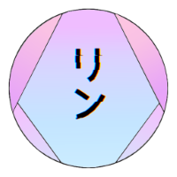

<div align=center>



# Starblaze

 

A complete rebuild of Rin's Site

<div align=left>

# Info

[Rin](https://github.com/No767/Rin) used to have a site, and that was built using Next.js + TS as well. But the issue was that the old repo was starting to conflict with the different projects. Starblze is just the new repo for Rin's official website.

# Development

Dependencies:

- [Node.js](https://nodejs.org/en/)
- [pnpm](https://pnpm.io/)

## Initial Setup

```bash
git clone https://github.com/[your-username]/Starblaze && cd Starblaze/starblaze-next && pnpm install
```

## Running Dev Server

```bash
pnpm run dev
```

## Thanks

This website is hosted by Vercel. Thanks!


# License
GPL-3.0